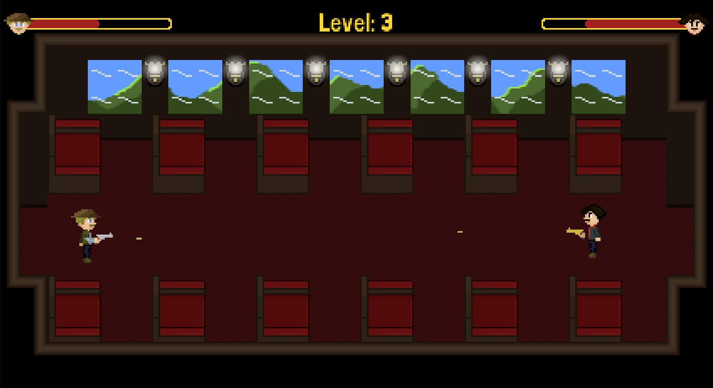

# Infinite Train

Infinite Train is a shoot 'em up game situated inside an infinite train that depicts a shootout between cowboys and a train's passenger in the old west.



## How to Play

The goal of the game is to survive as long as possible while shooting in the cowboys that appear in each wagon. The controls are simple:

- Use the W/A/S/D keys to move the character;
- Use the space bar to shoot.

You will notice an increase in the speed of the cowboy's bullets as you progress through each wagon. Be careful not to get hit by those, as it will result in loss of life. The game ends when your life bar becomes completely empty.

## Installation

### Ubuntu

1. Add this PPA to your system

```sudo add-apt-repository ppa:bartbes/love-stable```

2. Update your system's package list

```sudo apt update```

3. Install LÖVE

```sudo apt install love```

## Usage

1. Using the ```cd``` command, go to the project's root folder

2. Execute the game

```love .```

## License

Infinite Train is licensed under the MIT License. Please refer to the LICENSE file for more information.
